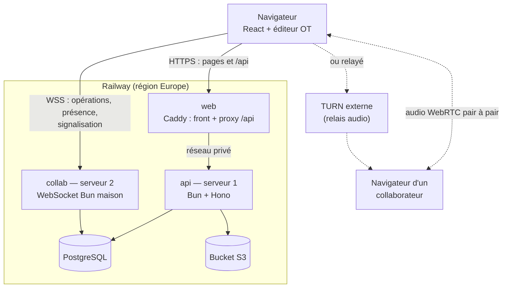
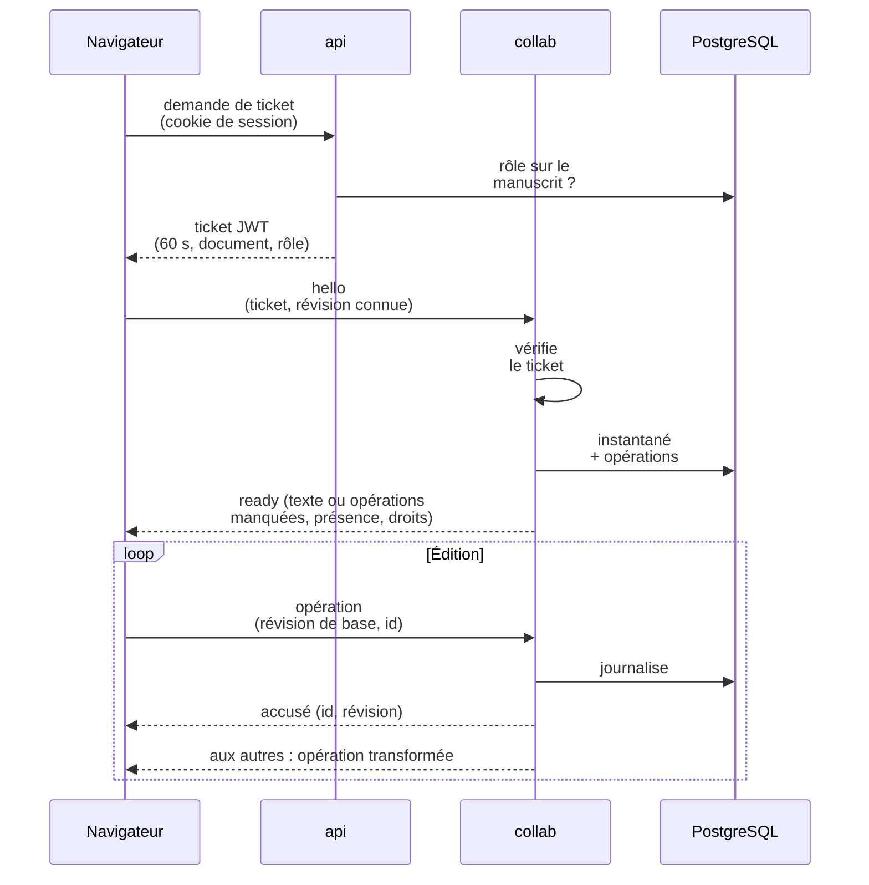
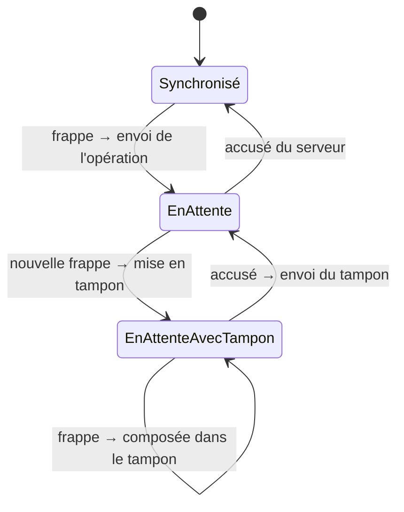
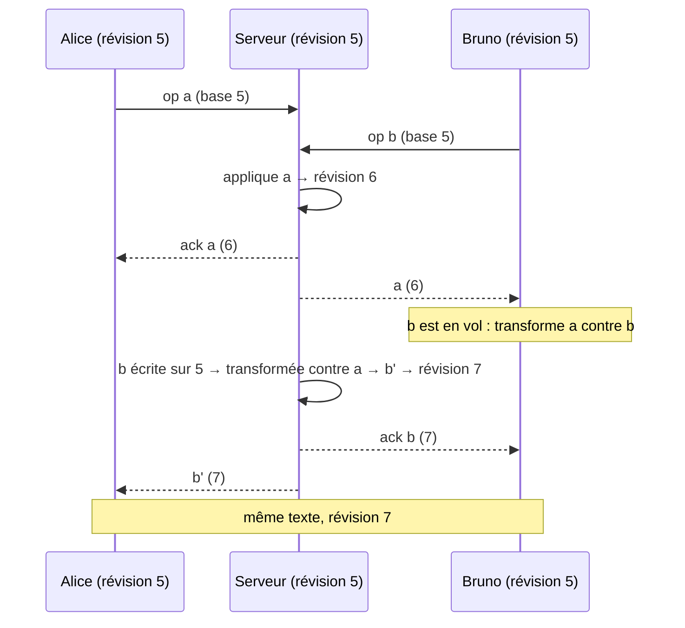
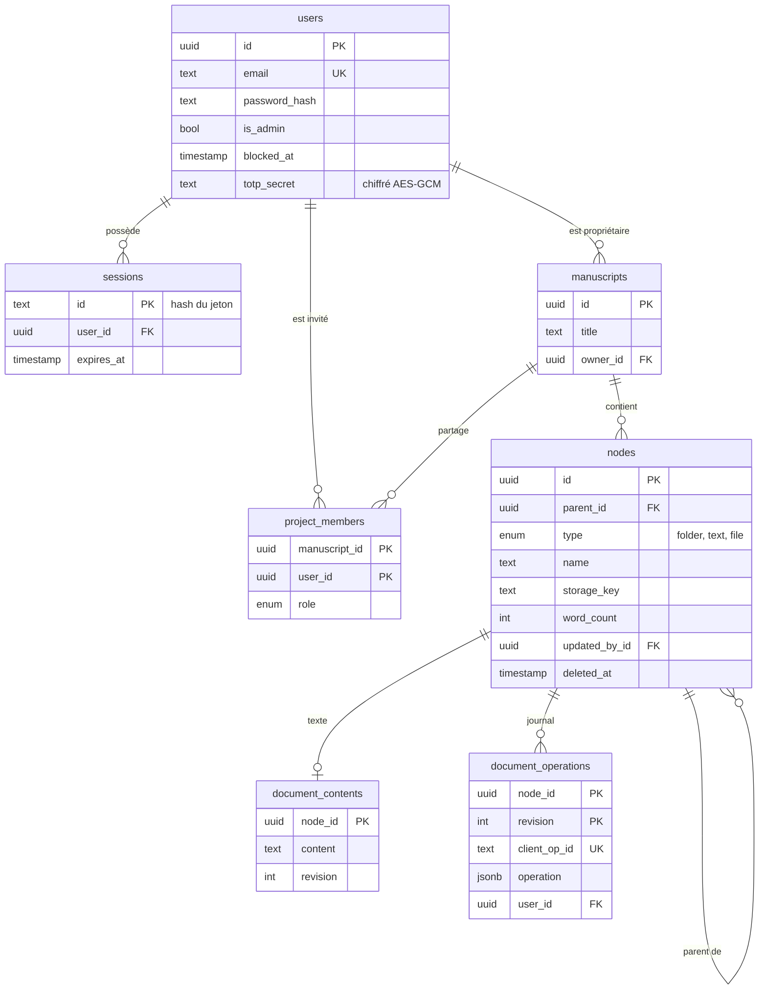

# Manuspace — Dossier des choix techniques et organisationnels

> Espace cloud pour auteurs : organiser ses romans, écrire ses chapitres à plusieurs en temps réel,
> stocker ses ressources et discuter à voix haute pendant une séance de correction.
> Adaptation « roman » du sujet d'application collaborative de construction de documents.

Production : <https://manuspace.up.railway.app>

---

## Sommaire

1. [Résumé](#1-résumé)
2. [Exigences du sujet et couverture](#2-exigences-du-sujet-et-couverture)
3. [Architecture générale](#3-architecture-générale)
4. [Choix technologiques](#4-choix-technologiques)
5. [Édition collaborative : l'algorithme](#5-édition-collaborative--lalgorithme)
6. [Authentification et sécurité](#6-authentification-et-sécurité)
7. [Fichiers (PDF, images)](#7-fichiers-pdf-images)
8. [Appel audio](#8-appel-audio)
9. [Modèle de données](#9-modèle-de-données)
10. [Résilience : que se passe-t-il quand…](#10-résilience--que-se-passe-t-il-quand)
11. [Déploiement](#11-déploiement)
12. [Qualité et tests](#12-qualité-et-tests)
13. [Organisation du travail](#13-organisation-du-travail)
14. [Limites et perspectives](#14-limites-et-perspectives)
15. [Glossaire](#15-glossaire)

---

## 1. Résumé

| Élément | Choix |
|---|---|
| **Front** | React 19 + Vite (application monopage), TanStack Router/Query, Tailwind CSS v4, shadcn/ui |
| **Serveur 1 — API métier** | Bun + Hono, PostgreSQL + Drizzle ORM, stockage S3 |
| **Serveur 2 — Collaboration** | Bun, WebSocket **maison** : autorité de transformation opérationnelle, présence, signalisation WebRTC |
| **Édition collaborative** | Algorithme **OT (transformation opérationnelle) à autorité centrale, écrit par nous**, éditeur texte + Markdown léger **écrit par nous** |
| **Appel audio** | WebRTC en maillage (plusieurs participants), STUN/TURN |
| **Déploiement** | Railway : services `web`, `api`, `collab`, PostgreSQL et bucket S3, décrits en code |
| **Tests** | 144 tests automatisés + 2 scénarios de bout en bout à deux navigateurs, exécutés en intégration continue |

**Principe directeur** : les compétences évaluées (authentification, 2FA, permissions,
collaboration temps réel, appel audio, déploiement sur deux serveurs) sont **développées par nous**.
Les bibliothèques retenues sont des briques générales (framework HTTP, ORM, validation,
composants d'interface), jamais une solution complète de la fonctionnalité demandée.
En particulier, **aucune bibliothèque de synchronisation (Yjs, CRDT, ShareDB…) ni d'éditeur riche
(Tiptap, ProseMirror…)** n'est utilisée.

---

## 2. Exigences du sujet et couverture

| Exigence | Réalisation | Où |
|---|---|---|
| Formulaire de connexion, connexion | Email + mot de passe (argon2id), étape 2FA si activée | `apps/api/src/routes/auth.ts`, `apps/web/src/routes/login.tsx` |
| Déconnexion | Révocation de la session en base + suppression du cookie | `routes/auth.ts` |
| Activer et configurer la 2FA | TOTP (RFC 6238) : QR code puis confirmation par code ; désactivation par mot de passe + code | `routes/account.ts`, `routes/_app/compte.tsx` |
| Modifier son profil | Nom, email, mot de passe (révoque les autres sessions) | `routes/account.ts` |
| Documents en dossiers/fichiers, date et dernier éditeur | Arborescence de manuscrits (dossiers, chapitres, ressources), date et auteur de la dernière modification sur chaque élément | `routes/manuscripts.ts`, `components/library/*` |
| Édition temps réel avec sauvegarde automatique | Éditeur collaboratif OT, opérations journalisées avant confirmation, instantané automatique | `packages/shared/src/ot`, `apps/collab`, `components/editor/*` |
| Stocker, remplacer, supprimer PDF/images | Import (y compris glisser-déposer), aperçu, remplacement, suppression ; type réel vérifié | `routes/files.ts`, `components/library/file-details.tsx` |
| Inviter une personne et éditer à plusieurs | Invitation par email avec un rôle (co-auteur, correcteur, bêta-lecteur) | `routes/manuscripts.ts`, `components/library/share-dialog.tsx` |
| Appel audio avec un collaborateur | WebRTC, signalisation par le serveur collab | `components/editor/use-call.ts`, `apps/collab/src/room.ts` |
| Admin : créer un compte | Page Administration + script de premier administrateur | `routes/admin.ts`, `scripts/create-admin.ts` |
| Admin : bloquer / débloquer | Un compte bloqué ne peut plus se connecter et ses sessions sont révoquées immédiatement | `routes/admin.ts`, `lib/session.ts` |
| **Bonus** : appel à plusieurs | Maillage WebRTC (2 à 4 participants) | `use-call.ts` |
| **Bonus** : curseurs des utilisateurs | Curseurs des collaborateurs superposés au texte | `collab-textarea.tsx` |
| **Bonus** : historique des versions | Sessions d'écriture reconstruites depuis le journal d'opérations, comparaison par paragraphe, restauration par une opération OT (annulable, visible en direct) | `lib/versions.ts`, `history-panel.tsx`, `version-view.tsx` |
| **Bonus** : corbeille et restauration | Restauration du lot supprimé ensemble, suppression définitive (fichiers du bucket compris), purge après 30 jours | `lib/trash.ts`, `components/library/trash-view.tsx` |
| **Bonus** : messagerie pendant l'édition | Discussion de la session du document, compteur de non-lus, anti-inondation | `chat-panel.tsx`, `apps/collab/src/room.ts` |
| **Bonus** : personnalisation | Couleurs des dossiers et fichiers façon tags du Finder (partagées, sans changer le « dernier éditeur »), interface façon macOS en clair ou sombre | `components/library/color-swatches.tsx`, `lib/theme.ts` |
| Backend JavaScript/TypeScript | TypeScript partout (Bun) | — |
| Déploiement sur deux serveurs | Serveur 1 `api` et serveur 2 `collab` (+ service `web` pour le front) | `.railway/railway.ts` |
| Pas de perte importante à la déconnexion | Copie locale IndexedDB, renvoi idempotent, journal d'opérations | § 5.6 et § 10 |
| `.env.example`, README, documentation | Présents à la racine et dans `docs/` | — |

---

## 3. Architecture générale

### 3.1 Vue d'ensemble



- **`web`** sert l'application et relaie `/api` vers l'API par le **réseau privé** de Railway.
  Le navigateur ne voit ainsi qu'**une seule origine** : le cookie de session fonctionne sans CORS.
  Deux domaines `*.up.railway.app` distincts seraient deux « sites » différents (le suffixe figure
  dans la liste publique des suffixes), et le cookie deviendrait un cookie tiers, bloqué par Safari.
- **`api` (serveur 1)** porte toute la logique métier. Elle n'a **aucune adresse publique** : `web`
  est son seul point d'entrée HTTP.
- **`collab` (serveur 2)** porte le temps réel. Il est public (WebSocket) mais n'accepte qu'un
  **ticket** signé par l'API.

### 3.2 Répartition des responsabilités entre les deux serveurs

| Serveur 1 — `api` | Serveur 2 — `collab` |
|---|---|
| Authentification, sessions, 2FA | Autorité OT : ordre et transformation des opérations |
| Profils, administration | Journal des opérations, instantanés des documents |
| Manuscrits, arborescence, permissions | Présence, curseurs et messagerie de session |
| Fichiers (S3) | Signalisation de l'appel audio |
| Délivrance des tickets collab | Vérification des tickets |

Les deux serveurs **ne s'appellent jamais directement**. Ils partagent la base (via le paquet
`packages/db`) et un secret : l'API signe un ticket, le serveur collab le vérifie. Chacun peut ainsi
être redéployé sans l'autre.

### 3.3 Ouverture d'un chapitre



### 3.4 Organisation du code (monorepo)

```
apps/
  web/        Front React (Vite) ; Caddyfile et Dockerfile du service web
  api/        Serveur 1 (Hono) ; tests d'intégration sur une base dédiée
  collab/     Serveur 2 (WebSocket) ; tests d'intégration avec de vrais WebSockets
packages/
  shared/     Code commun front / serveurs : algorithme OT, Markdown, protocole, schémas Zod
  db/         Schéma Drizzle et migrations
e2e/          Scénarios de bout en bout à deux navigateurs (Playwright)
.railway/     Infrastructure Railway décrite en TypeScript
infra/        docker-compose de développement (PostgreSQL, S3)
```

Le paquet **`shared`** est un choix structurant : l'algorithme OT et les schémas de validation sont
**le même code** côté navigateur et côté serveur. Un message ou une opération ne peut pas être
interprété différemment de part et d'autre.

---

## 4. Choix technologiques

Pour chaque couche : le choix, sa justification, et les alternatives écartées. Plusieurs choix
**s'écartent de la stack proposée initialement** ; ces écarts sont argumentés.

### 4.1 Runtime : Bun

- **Pourquoi** : un seul outil pour l'exécution TypeScript sans compilation, le gestionnaire de
  paquets (workspaces), les tests (`bun test`), le hachage de mots de passe (`Bun.password`,
  argon2id), le client S3 (`Bun.S3Client`) et le serveur WebSocket (`Bun.serve`). Moins de
  dépendances, donc moins de surface d'attaque et de maintenance.
- **Risque identifié** : compatibilité imparfaite avec certains modules Node. Constaté deux fois
  (voir § 12.3) et contourné. Le framework HTTP (Hono) reste portable vers Node si besoin.

### 4.2 Front : React + Vite (et non Next.js)

- **Pourquoi** : l'application est entièrement derrière une connexion et dialogue avec deux
  serveurs. Le rendu serveur de Next.js n'apporte rien au référencement ici, et ajouterait un
  troisième serveur applicatif. Une application monopage Vite est plus simple à déployer
  (fichiers statiques servis par Caddy) et plus rapide à développer.
- **TanStack Router** : routes typées, gardes d'authentification (`beforeLoad`), paramètres de
  recherche validés (document sélectionné dans l'URL).
- **TanStack Query** : cache et invalidation des données (arborescence, membres…), gestion
  centralisée des erreurs (retour à la connexion sur 401).
- **Tailwind v4 + shadcn/ui** : composants accessibles (dialogues, menus) dont le code est copié
  dans le projet et modifiable, et non une dépendance opaque.

### 4.3 API : Hono (et non NestJS)

- **Pourquoi** : léger, standard (API `Request`/`Response` du web), **client RPC typé** : le front
  importe le type des routes et obtient l'autocomplétion et la vérification des appels à la
  compilation. NestJS impose une architecture lourde (modules, décorateurs, injection) peu
  utile pour une API de cette taille.
- **Validation** : chaque entrée est validée par un schéma **Zod** partagé avec le front.

### 4.4 Base de données : PostgreSQL + Drizzle (et non Prisma)

- **PostgreSQL** : données relationnelles (utilisateurs, manuscrits, membres, arborescence),
  contraintes d'intégrité (clés étrangères, unicité), requêtes récursives pour les sous-arbres,
  JSONB pour le journal d'opérations.
- **Drizzle** : requêtes proches du SQL et typées, aucun moteur externe à embarquer, migrations
  SQL lisibles et versionnées. Prisma aurait masqué le SQL (CTE récursives, `ON CONFLICT`) que
  nous voulions maîtriser.

### 4.5 Stockage des fichiers : S3

- **Bucket S3 Railway** en production, **RustFS** (compatible S3) en local. L'image MinIO
  initialement prévue n'est plus distribuée publiquement. Le même code (`Bun.S3Client`) sert
  partout.

### 4.6 Collaboration et éditeur : écrits par nous

La stack initiale prévoyait **Tiptap + Yjs + Hocuspocus**. Une première version a été réalisée
ainsi, puis **entièrement remplacée** : le sujet exige de ne pas s'appuyer sur une solution
complète existante, et l'algorithme de collaboration est précisément la compétence évaluée.

| Option | Décision |
|---|---|
| CRDT (Yjs, Automerge) | Écarté : bibliothèque interdite, et un CRDT maison fiable est long à écrire (identifiants de caractères, tombstones, ramasse-miettes) |
| Verrouillage (un seul rédacteur à la fois) | Écarté : ce n'est pas de l'édition simultanée |
| Dernier qui écrit gagne | Écarté : perte de données |
| **OT à autorité centrale** | **Retenu** : algorithme éprouvé (Jupiter, Google Docs), serveur unique qui ordonne, adapté à notre architecture à serveur dédié |

Pour l'éditeur :

| Option | Décision |
|---|---|
| Éditeur riche `contenteditable` maison | Écarté : sélection, saisie composée (IME), collage et annulation sont très difficiles à rendre fiables |
| Texte brut seul | Écarté : pas de titres ni d'italique, gênant pour un roman |
| **Zone de texte native + Markdown léger** | **Retenu** : saisie, accents, correcteur orthographique et mobile gérés nativement par le navigateur ; mise en forme par marques lisibles ; mode Lecture pour le rendu |

Le détail est au § 5.

### 4.7 Serveur web : Caddy

Sert les fichiers compilés (cache permanent des fichiers hachés, `no-cache` pour les pages),
compresse (zstd/gzip), ajoute les **en-têtes de sécurité** (CSP, HSTS, X-Frame-Options…) et
relaie `/api` en conservant l'en-tête `Host` (nécessaire à la protection CSRF, § 6.4).

### 4.8 Hébergement : Railway

Déploiement par conteneurs Docker, base et bucket gérés, **réseau privé** entre services,
certificats HTTPS automatiques, et **infrastructure décrite en code** (`.railway/railway.ts`).
Limite connue : pas d'UDP, donc pas de serveur TURN hébergé (§ 8.4).

---

## 5. Édition collaborative : l'algorithme

### 5.1 Le problème

Deux personnes éditent le même texte en même temps. Chacune voit ses frappes **immédiatement**
(sans attendre le réseau), donc leurs copies divergent temporairement. Il faut que toutes les
copies **convergent vers le même texte**, et que ce texte respecte **l'intention** de chacun.

### 5.2 Représentation d'une modification : `TextOperation`

Une opération parcourt tout le texte d'origine avec trois types de composants :

| Composant | Sens |
|---|---|
| entier positif `n` | conserver `n` caractères |
| entier négatif `-n` | supprimer `n` caractères |
| chaîne `"s"` | insérer `s` |

Exemple : sur `« Méduse dort »` (11 caractères), `[7, "s'éveille", -4]` donne `« Méduse s'éveille »`.

Opérations fournies (`packages/shared/src/ot/text-operation.ts`) :

- `apply(texte)` : applique l'opération ;
- `compose(a, b)` : une seule opération équivalente à `a` puis `b` ;
- `transform(a, b)` → `[a', b']` : **le cœur de l'OT** (voir ci-dessous) ;
- `invert(texte)` : l'opération inverse (annulation) ;
- `transformIndex(position)` : où se trouve un curseur après l'opération ;
- `fromDiff(avant, après)` : l'opération minimale entre deux états de la zone de texte, sans
  jamais couper un émoji en deux.

### 5.3 La transformation

`a` et `b` ont été écrites en parallèle sur le même texte. `transform` produit `a'` et `b'` telles
que :

```
apply(apply(texte, a), b') === apply(apply(texte, b), a')      (propriété de convergence, TP1)
```

**Exemple.** Texte `« abc »`. Alice insère `A` en position 3, Bruno insère `B` en position 3.

- `a = [3, "A"]`, `b = [3, "B"]`
- `transform(a, b)` → `a' = [3, "A", 1]`, `b' = [4, "B"]`. À position égale, l'opération passée
  en premier argument l'emporte : c'est une règle **déterministe**, identique partout.
- Alice : `« abcA »` puis `b'` → `« abcAB »` ; Bruno : `« abcB »` puis `a'` → `« abcAB »`.

### 5.4 Le client : une seule opération en vol

Le client (`packages/shared/src/ot/client.ts`) a trois états :



- Une seule opération voyage à la fois. Les frappes suivantes sont **composées** dans un tampon.
  C'est un regroupement naturel : lors d'un test, une phrase de 70 caractères a été envoyée en
  2 opérations seulement.
- Une opération reçue d'un autre est **transformée** contre ce qui n'est pas encore confirmé
  localement (opération en vol, puis tampon), puis appliquée au texte.

### 5.5 Le serveur : l'autorité centrale

Le serveur (`ServerDocument`, utilisé par `apps/collab/src/room.ts`) tient le texte de référence et
**numérote** chaque opération acceptée (la *révision*). Un client envoie son opération avec la
révision sur laquelle il l'a écrite. Si d'autres opérations ont été acceptées depuis, le serveur
transforme l'opération reçue contre chacune d'elles, l'applique, puis :

1. la **journalise en base** (table `document_operations`) ;
2. envoie un **accusé** à l'auteur ;
3. la **diffuse** aux autres participants.

Les opérations d'un même document sont traitées **l'une après l'autre** (file par document) :
l'ordre des révisions est garanti malgré les écritures asynchrones en base.



### 5.6 Durabilité et reprise après coupure

- **Journal avant accusé** : une frappe n'est confirmée (« Enregistré ») qu'une fois écrite en
  base. Un arrêt brutal du serveur ne perd donc aucune frappe confirmée.
- **Instantané** : le texte complet est enregistré 2 s après la dernière modification (au plus
  tard toutes les 10 s), avec le nombre de mots et le dernier éditeur. Au chargement, les
  opérations journalisées **après** le dernier instantané sont **rejouées**.
- **Copie locale** : le navigateur garde dans IndexedDB le texte, sa révision et les opérations
  non confirmées. Les frappes survivent à une coupure réseau **et à un rechargement de la page**.
- **Rattrapage** : à la reconnexion, le client envoie sa révision (`since`). Le serveur renvoie
  les opérations manquées (relues en base si elles ne sont plus en mémoire), le client les
  intègre puis renvoie les siennes.
- **Idempotence** : chaque opération porte un identifiant unique (contrainte d'unicité en base).
  Si la connexion tombe **après** que le serveur a appliqué une opération mais **avant** que
  l'accusé n'arrive, le client la reconnaît dans le rattrapage (ou le serveur reconnaît le
  renvoi) : elle n'est **jamais appliquée deux fois**.

### 5.7 L'éditeur

- **Zone de texte native** : chaque saisie est comparée au texte connu (`fromDiff`) pour produire
  l'opération. Les opérations des autres sont appliquées en préservant la sélection et le
  défilement.
- **Saisie composée** (accents, IME) : pendant une composition, les opérations reçues sont mises
  de côté, puis fusionnées **par transformation** à la fin. Modifier la zone à ce moment-là
  casserait la saisie en cours.
- **Annulation collaborative** : on n'annule que ses propres modifications. Les inverses en attente
  sont transformés contre les modifications des autres : ⌘Z ne défait jamais le texte d'un
  co-auteur. Les frappes rapprochées forment un groupe, qu'un déplacement du curseur clôt.
- **Curseurs distants** : la position d'un collaborateur est transposée dans le texte local
  (opérations survenues depuis + modifications non confirmées), puis mesurée dans un **calque
  miroir** invisible qui reproduit exactement la mise en page de la zone de texte.
- **Markdown léger** (`packages/shared/src/markdown.ts`) : analysé en **arbre**, puis rendu en
  éléments React. Aucun HTML n'est jamais injecté, et une balise `<script>` tapée reste du texte.

### 5.8 Historique des versions

Le journal d'opérations, conservé depuis la création du document, suffit à **reconstruire le
texte à n'importe quelle révision** : les opérations sont rejouées depuis le texte vide. Aucune
copie supplémentaire n'est stockée.

- Les versions présentées sont des **sessions d'écriture** : une pause de plus de 10 minutes
  ouvre une nouvelle version (date, auteurs, nombre de modifications).
- **Comparaison** avec le texte actuel, paragraphe par paragraphe (plus longue sous-séquence
  commune, `packages/shared/src/line-diff.ts`).
- **Restaurer** n'écrase rien en base : l'éditeur calcule l'opération qui transforme le texte
  actuel en celui de la version et l'applique comme une modification normale. Elle passe donc
  par l'OT : les co-auteurs connectés la voient en direct, elle entre elle-même dans
  l'historique, et ⌘Z l'annule.

### 5.9 Pourquoi on peut avoir confiance dans l'algorithme

Voir § 12 : propriétés vérifiées sur 8 000 cas aléatoires, et **simulation** de 4 clients
concurrents avec un réseau désordonné, des coupures et des messages perdus. Sur 200 scénarios
(21 086 frappes, 2 746 coupures, 909 renvois dédoublonnés), tous les clients convergent vers le
texte du serveur.

---

## 6. Authentification et sécurité

### 6.1 Sessions opaques (et non JWT)

- Jeton aléatoire de 256 bits dans un cookie `httpOnly`, `SameSite=Lax`, `Secure` et préfixe
  `__Host-` en production. **Seul son hash SHA-256** est stocké en base : une fuite de la base ne
  permet pas d'usurper une session.
- **Pourquoi pas un JWT ?** Un JWT ne se révoque pas facilement. Or le sujet exige qu'un compte
  **bloqué** ne puisse plus rien faire : avec des sessions en base, le blocage supprime ses
  sessions et prend effet à la requête suivante.
- Durée de 30 jours, prolongée à l'usage. Changer son mot de passe révoque toutes les autres
  sessions.

### 6.2 Mots de passe et 2FA

- **argon2id** (`Bun.password`), 12 caractères minimum.
- Email inconnu : le serveur vérifie quand même un hash factice, pour que le temps de réponse
  soit identique et que l'existence d'un compte ne soit pas révélée.
- **Limite de tentatives** : 10 par compte toutes les 15 minutes.
- **TOTP** : activation en deux temps (QR code, puis code prouvant que l'application est
  configurée). Le secret est **chiffré en AES-256-GCM** en base, avec une clé fournie par
  l'environnement.

### 6.3 Permissions

| Rôle | Lire | Écrire, organiser, importer | Gérer le manuscrit et les membres |
|---|:-:|:-:|:-:|
| Auteur principal (OWNER) | ✓ | ✓ | ✓ |
| Co-auteur (EDITOR) | ✓ | ✓ | |
| Correcteur (COMMENTER) | ✓ | | |
| Bêta-lecteur (VIEWER) | ✓ | | |

- Vérifiées **côté serveur** à chaque requête (middleware `requireRole`). L'interface ne fait que
  masquer les actions interdites.
- Manuscrit inaccessible : réponse **404** (et non 403), pour ne pas révéler son existence.
- Serveur collab : le rôle vient du **ticket** signé par l'API. Un bêta-lecteur est en lecture
  seule, et ses opérations sont refusées par le serveur.

### 6.4 Protection des échanges

| Risque | Mesure |
|---|---|
| CSRF | Cookie `SameSite=Lax` + middleware qui refuse les requêtes « formulaire » d'une autre origine. L'origine est comparée à l'en-tête `Host`, qui reste juste derrière les proxys (§ 12.3) |
| XSS | React échappe tout. Le Markdown est rendu depuis un arbre, jamais en HTML. CSP stricte (`script-src 'self'`) |
| Clickjacking | `X-Frame-Options: SAMEORIGIN` et `frame-ancestors 'self'` (seules nos pages intègrent l'aperçu PDF) |
| Interception | HTTPS partout, HSTS |
| Injection SQL | Requêtes paramétrées (Drizzle), entrées validées par Zod |
| Accès au temps réel | Ticket JWT HS256 de **60 s**, lié à **un** document et à un rôle, demandé à chaque (re)connexion |
| Messages WebSocket malformés | Chaque message est validé par un schéma Zod, avec des tailles maximales |
| Usurpation dans l'appel | Le serveur vérifie que l'expéditeur possède l'identifiant qu'il annonce |

---

## 7. Fichiers (PDF, images)

- **L'upload passe par l'API** plutôt que d'aller directement au bucket via une URL présignée.
  Le fichier est ainsi **vérifié avant stockage**, tout reste sur la même origine (CSP stricte,
  pas de CORS sur le bucket), et chaque lecture repasse par un contrôle de droits.
- **Type réel** : identifié par la **signature binaire** du contenu (« magic bytes »), jamais
  par l'extension ni par le type annoncé par le navigateur. Seuls PDF, PNG, JPEG, WebP et GIF
  sont acceptés. SVG et HTML sont refusés : servis depuis notre domaine, ils pourraient exécuter
  du script.
- Taille maximale de 20 Mo (vérifiée avant lecture du corps). Nom nettoyé (ni chemin ni
  caractère de contrôle).
- Lecture : type détecté à l'import, `X-Content-Type-Options: nosniff`, cache privé.
- Chaque remplacement écrit un **nouvel objet** et supprime l'ancien. La suppression d'un
  manuscrit supprime ses objets.

---

## 8. Appel audio

### 8.1 Maillage WebRTC

Chaque participant est relié directement à chacun des autres. Pas de serveur média à héberger,
latence minimale, adapté à 2 à 4 personnes (séance de co-écriture ou de correction). Au-delà,
un serveur de relais (SFU) deviendrait nécessaire.

### 8.2 Signalisation par le serveur collab

Offres, réponses et candidats ICE passent par le WebSocket déjà authentifié du document :

- remis **au seul destinataire** (ces messages contiennent des adresses réseau) ;
- l'expéditeur doit **posséder** l'identifiant qu'il annonce ;
- le serveur annonce les **départs**, y compris la fermeture brutale d'un onglet.

Pour chaque paire, c'est toujours le même participant (le plus petit identifiant) qui envoie
l'offre : les deux ne peuvent pas s'appeler en même temps.

### 8.3 Résilience

L'audio circule **entre navigateurs**, pas par le serveur collab. Si celui-ci redémarre,
**l'appel continue** : l'affichage des participants est figé pendant la coupure, et chacun se
réinscrit à la reconnexion. Le client ne raccroche que sur annonce du serveur ou échec de la
connexion WebRTC.

### 8.4 STUN / TURN

L'API fournit la configuration ICE : STUN public, plus un **TURN** (Metered) dont les identifiants
sont dans les variables d'environnement. Le TURN relaie l'audio quand la connexion directe est
impossible (box 4G, réseaux d'entreprise ou d'école). Railway ne gérant pas l'UDP, il s'agit d'un
service externe. **Vérifié en production** : avec les connexions directes interdites
(`E2E_FORCE_RELAY=1`), l'audio passe par le relais (paire de candidats `relay/relay`).

---

## 9. Modèle de données



- **Arborescence** : une seule table `nodes` avec `parent_id` (dossier, chapitre ou fichier).
  Le déplacement vérifie l'absence de cycle. La suppression est **douce** (`deleted_at`) et
  récursive (CTE, une seule requête) : tous les éléments supprimés ensemble partagent le même
  horodatage, ce qui identifie le **lot** à restaurer depuis la **corbeille**. Un élément supprimé
  séparément avant son dossier reste ainsi dans la corbeille quand on restaure le dossier ; si son
  dossier n'existe plus, il revient à la racine. Suppression définitive (lignes en cascade et
  fichiers du bucket) réservée à l'auteur principal ; purge automatique après 30 jours.
- **Dernier éditeur** : `updated_by_id` et `updated_at`, sur l'horloge de PostgreSQL pour les deux
  serveurs (§ 12.3).

---

## 10. Résilience : que se passe-t-il quand…

| Situation | Comportement | Vérifié par |
|---|---|---|
| Le réseau de l'auteur tombe | « Hors ligne · modifications gardées sur cet appareil » ; on continue d'écrire | e2e éditeur |
| … et il recharge la page | Texte et frappes non envoyées relus depuis IndexedDB | e2e éditeur (`E2E_KILL_COLLAB`) |
| Le réseau revient | Reconnexion immédiate (événement `online`), rattrapage, renvoi, fusion | e2e éditeur |
| Coupure silencieuse (veille, Wi-Fi) | Ping toutes les 10 s ; sans réponse depuis 25 s, la connexion est déclarée morte | code |
| Accusé perdu | Opération reconnue par son identifiant, jamais appliquée deux fois | test de simulation + test serveur |
| Redéploiement du serveur collab | Instantanés enregistrés, sockets fermés, reconnexion en moins de 5 s ; appel audio maintenu | e2e appel + test serveur |
| Arrêt brutal du serveur collab | Opérations journalisées rejouées au chargement | test serveur |
| Deux personnes tapent en même temps | Transformation, convergence identique | simulation + e2e |
| Opération incohérente (bug client) | Le serveur refuse et ferme ; le client repart du texte du serveur | test serveur |
| Compte bloqué pendant l'édition | Sessions révoquées ; plus de ticket, donc plus de reconnexion | tests API |

---

## 11. Déploiement

- **Deux serveurs applicatifs** (`api`, `collab`) et un service **`web`**, chacun avec son
  Dockerfile. S'y ajoutent PostgreSQL et un bucket S3, en région Europe.
- **Infrastructure en code** : `.railway/railway.ts` décrit les services, les variables, les
  healthchecks, la migration automatique avant chaque déploiement de l'API, l'absence de mise en
  veille du service temps réel et le délai d'arrêt propre. Les secrets n'y figurent pas.
  `railway config plan` montre les changements avant `railway config apply`.
- **Arrêt propre** du serveur collab : instantanés enregistrés, puis fermeture des sockets, sans
  annonce de départ (les appels continuent).
- Dépôt local reproductible : `bun infra:up` (PostgreSQL + S3), `bun db:migrate`, `bun dev`.

---

## 12. Qualité et tests

### 12.1 Tests automatisés (144)

| Paquet | Tests | Contenu |
|---|---:|---|
| `shared` | 27 | OT : exemples, **propriétés sur 8 000 cas aléatoires** (composition, convergence, inversion, diff), **simulation** de 4 clients concurrents avec coupures ; Markdown ; comparaison par paragraphe ; palette de couleurs |
| `api` | 77 | Intégration sur une base PostgreSQL dédiée : connexion, 2FA, CSRF, admin, blocage, manuscrits, arborescence, permissions, fichiers sur le stockage S3 réel, corbeille (lots, restauration, purge), historique des versions (sessions, reconstruction), serveurs ICE, couleurs des éléments (validation, droits, « dernier éditeur » inchangé, conservation en corbeille) |
| `collab` | 19 | Intégration avec de vrais WebSockets : authentification, transformation, doublons, rattrapage, lecture seule, désynchronisation, instantanés, rejeu, présence, appel, messagerie, arrêt |
| `web` | 21 | Annulation collaborative, commandes de mise en forme, résolution du thème clair/sombre (stockage inaccessible compris), **contraste des couleurs du thème ≥ 4,5:1** |

`bun run test` lance tout. Les générateurs aléatoires sont à graine fixe, donc les tests sont
reproductibles. **Intégration continue** (GitHub Actions, `.github/workflows/ci.yml`) : à chaque push
et pull request, lint, types, tests (avec PostgreSQL et un stockage S3 démarrés pour l'occasion)
et build du front.

### 12.2 Scénarios de bout en bout (deux navigateurs réels)

- `bun run e2e:editor` : frappe reçue en direct, **frappe simultanée** fusionnée à l'identique,
  curseur distant affiché, messagerie (message, non-lu, réponse), annulation limitée à ses propres frappes, coupure réseau. Avec
  `E2E_KILL_COLLAB=1` : arrêt du serveur, rechargement de la page, relance.
- `bun run e2e:call` : appel avec **micro simulé**, **niveau sonore mesuré à la réception** des
  deux côtés, micro coupé, départ. Avec `E2E_KILL_COLLAB=1` : l'appel continue pendant l'arrêt du
  serveur. Avec `E2E_FORCE_RELAY=1` : connexions directes interdites, l'audio doit passer par le
  serveur TURN.

Les deux scénarios sont autonomes (ils créent leur manuscrit puis le suppriment) et paramétrables
(`E2E_BASE_URL`, comptes) : ils ont aussi été **exécutés contre la production**, avec deux comptes
de test supprimés ensuite.

### 12.3 Défauts trouvés grâce aux tests (et corrigés)

Les tests ont révélé de vrais défauts, dont plusieurs n'apparaissaient qu'en production :

| Défaut | Découvert par | Correction |
|---|---|---|
| CSRF : requêtes légitimes refusées derrière le proxy HTTPS de Railway | Test manuel en production | Comparaison de l'origine avec l'en-tête `Host` + test de non-régression |
| Bucket S3 introuvable en production (`NoSuchBucket`) | Aller-retour d'écriture exécuté dans le conteneur de production | Construction correcte de l'URL « virtual-hosted » + test |
| Dates de modification antérieures aux créations | Test d'arborescence | Horloge unique (PostgreSQL) pour l'API et le serveur collab |
| Serveur collab bloqué à l'arrêt (clients figés) | Test de coupure | Sauvegardes attendues puis fermeture réelle des sockets |
| Appel raccroché lors d'un redémarrage du serveur | e2e appel avec coupure | Départs annoncés par le serveur uniquement, et pas pendant un arrêt |
| Annulation fragmentée pendant une frappe simultanée | e2e éditeur | Groupes d'annulation conservés, clos par un déplacement du curseur |
| Coupure réseau non détectée | e2e éditeur | Événement `offline` + chien de garde (ping) |
| Boucle de rendu infinie dans l'éditeur | Test dans le navigateur | Mémoïsation des participants à l'appel |
| Playwright instable sous Bun | Exécution des e2e | Scénarios exécutés avec Node |

### 12.4 Outillage

- **TypeScript strict** sur les cinq paquets (`bun run typecheck`).
- **Biome** : lint et formatage (`bun run lint`), y compris les règles d'accessibilité.
- **Accessibilité** : navigation au clavier (menu « Déplacer vers… » en alternative au
  glisser-déposer), libellés ARIA, annonces d'état (`role="status"`).

---

## 13. Organisation du travail

### 13.1 Un projet mené seul

Le projet a été réalisé **individuellement**. Sans équipe pour se répartir le travail ni se
relire mutuellement, l'organisation vise deux objectifs : avancer par **étapes livrables** et
**remplacer la relecture humaine par des vérifications automatiques** systématiques.

### 13.2 Des incréments livrables

Le travail a avancé par **lots fonctionnels** : chaque lot est complet, testé et déployé avant le
suivant. Dans le dépôt, un lot correspond à une série de commits sur `main` :

| Lot | Contenu |
|---|---|
| 1 | Monorepo, base de données, authentification (2FA, profil, administration), bibliothèque, invitations et rôles, front et API séparés, intégration continue |
| 2 | Fichiers PDF et images, algorithme OT, serveur de collaboration, éditeur Markdown, reprise hors ligne |
| 3 | Appel audio WebRTC à plusieurs, relais TURN, messagerie de session |
| 4 | Corbeille et restauration, historique des versions, interface façon macOS, couleurs des dossiers et fichiers |
| 5 | Scénarios de bout en bout à deux navigateurs, dossier des choix techniques |

- **Commits conventionnels** (`feat`, `fix`, `test`, `docs`, `chore`), un par partie cohérente
  d'un lot (serveur, API, interface, documentation).
- Un lot n'est intégré que lorsque lint, types et tests sont verts ; les commits intermédiaires
  d'un même lot peuvent dépendre du suivant.

### 13.3 Remplacer la relecture par des vérifications

| Vérification | Quand |
|---|---|
| Lint, types stricts, 144 tests | À chaque modification, en local |
| Intégration continue (GitHub Actions) | À chaque push : lint, types, tests et build |
| Scénarios de bout en bout à deux navigateurs | À chaque évolution de l'éditeur ou de l'appel |
| Vérification en production | Après chaque déploiement : santé des services, en-têtes, stockage, et scénarios de bout en bout contre le site réel |

**Définition de « terminé »** : lint, types et tests verts, vérification dans un navigateur,
intégration continue verte, déploiement, puis contrôle en production. Plusieurs défauts n'ont été
trouvés qu'à cette dernière étape (§ 12.3), ce qui justifie a posteriori de ne jamais s'arrêter au
seul « ça marche en local ».

### 13.4 S'adapter à un changement de contrainte

Une première version de l'édition collaborative reposait sur des bibliothèques existantes (Yjs,
Hocuspocus, Tiptap). Quand il a été précisé que ni bibliothèque de synchronisation ni éditeur
riche n'étaient autorisés, cette partie a été **entièrement réécrite** avant d'être livrée (lot 2) : algorithme OT,
serveur WebSocket, éditeur et reprise hors ligne. Le découpage en paquets (`shared`, `collab`,
`web`) et les tests existants ont limité l'impact : l'authentification, la bibliothèque, les
fichiers et l'appel audio n'ont presque pas changé.

### 13.5 Outils

- **Git et GitHub** : commits conventionnels par lot, intégration continue (GitHub Actions).
- **Railway** : hébergement, avec l'infrastructure décrite en code.
- **Biome, TypeScript, Bun test, Playwright** : qualité et tests.
- **Assistant de programmation IA (Claude Code)**, utilisé pour le développement, les tests et
  la rédaction de la documentation. Les choix structurants (pile technique, séparation front /
  API, remplacement des bibliothèques de collaboration, éditeur Markdown) ont été arbitrés par
  l'auteur.

## 14. Limites et perspectives

### 14.1 Limites connues (assumées)

- **Markdown visible pendant l'écriture** : c'est le compromis d'un éditeur entièrement fait
  main. Le rendu mis en page est dans le mode Lecture.
- **Frappe au même endroit au même instant** : les caractères des deux auteurs peuvent
  s'entremêler (limite classique de l'OT caractère par caractère). Le texte reste identique pour
  tous.
- **Un seul serveur collab** : les documents ouverts sont en mémoire. Pour plusieurs instances,
  il faudrait router chaque document vers une instance fixe, ou partager l'état (Redis
  Pub/Sub).
- **Journal d'opérations conservé indéfiniment** : il porte l'historique des versions. Pour de
  très longs documents, reconstruire une version ancienne rejoue beaucoup d'opérations ; des
  instantanés intermédiaires (tous les N révisions) accéléreraient la reconstruction.
- **Limiteur de tentatives en mémoire** : suffisant pour une seule instance d'API.
- Bundle principal d'environ 510 ko (160 ko compressé) : un découpage plus fin serait possible.

### 14.2 Bonus possibles

| Bonus | Piste |
|---|---|
| Commentaires / mode correction | Ancres transposées par `transformIndex`, comme les curseurs |
| Statistiques d'écriture | Nombre de mots déjà calculé à chaque instantané : historique et objectifs |

---

## 15. Glossaire

| Terme | Définition |
|---|---|
| **OT** (transformation opérationnelle) | Technique de collaboration : les opérations concurrentes sont transformées pour tenir compte les unes des autres, afin que toutes les copies convergent |
| **Autorité centrale** | Un serveur unique décide de l'ordre des opérations (révisions) |
| **CRDT** | Structure de données qui converge sans autorité centrale (ex. Yjs) ; non utilisée ici |
| **Révision** | Numéro d'ordre des opérations acceptées par le serveur pour un document |
| **Idempotent** | Qui produit le même effet appliqué une ou plusieurs fois |
| **IME / saisie composée** | Saisie de caractères en plusieurs frappes (accents morts, langues asiatiques) |
| **Ticket collab** | Jeton court signé par l'API donnant accès à un document sur le serveur collab |
| **WebRTC** | Communication audio/vidéo directe entre navigateurs |
| **SDP / ICE** | Description d'une session média / recherche d'un chemin réseau entre deux navigateurs |
| **STUN / TURN** | Découverte de son adresse publique / relais du flux quand la connexion directe échoue |
| **CSP** | Politique de sécurité du contenu : liste des sources autorisées (scripts, connexions…) |
| **CSRF** | Attaque qui fait exécuter une action par le navigateur d'un utilisateur connecté, depuis un autre site |
